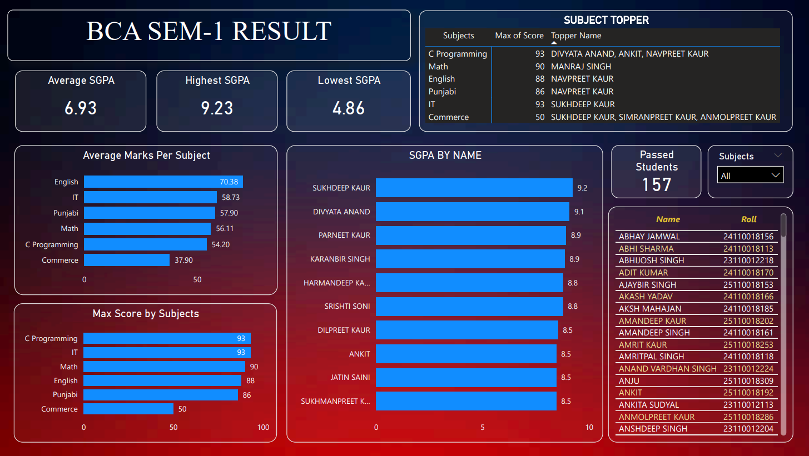

# 📊 BCA Result Analytics System

An end-to-end data analytics project that extracts, processes, and visualizes student performance data from a college result portal.

---

## 🚀 Project Overview

This project demonstrates a complete data pipeline:

**Web Scraping → Data Processing → Database Storage → Analysis → Visualization**

We collected and analyzed results of 300+ students and transformed raw data into meaningful insights using Power BI.

---

## 🛠 Tech Stack

- 🐍 Python (Requests, BeautifulSoup)
- 🗄 SQLite (Database)
- 📊 Pandas (Data Processing)
- 📈 Power BI (Visualization)

---

## ⚙️ Features

- 🔍 Scrapes student results from college website
- 🧹 Cleans and structures raw data
- 🗄 Stores data in SQLite database
- 🏆 Generates merit list (based on SGPA)
- 🎯 Identifies subject-wise toppers
- 📊 Exports clean dataset for analysis
- 📈 Visualizes insights using Power BI dashboards

---

## 📊 Dashboard Preview



---

## 📈 Key Insights

- Highest & Lowest SGPA
- Subject-wise performance analysis
- Top-performing students
- SGPA distribution across class
- Comparative subject difficulty

---

## 📂 Project Structure
```
bca-result-analytics/
│
├── scraper.py # Scrapes result data
├── analyzer.py # Generates merit & toppers
├── export.py # Exports clean Excel dataset
├── final_results.xlsx # Processed dataset
├── requirements.txt # Dependencies
├── .gitignore
│
├── dashboard_screenshots/
│ └── dashboard1.png

```
---

## ▶️ How to Run

### 1️⃣ Install dependencies
bash
pip install -r requirements.txt
### 2️⃣ Run scraper
python scraper.py
### 3️⃣ Generate analysis
python analyzer.py
### 4️⃣ Export dataset
python export.py
### 🤝 Collaboration

This project was built collaboratively:

### 👨‍💻 Data Engineering & Backend
Gurlal Singh
### 🔗 https://github.com/gurlalbhullarz

### 📊 Data Visualization (Power BI Dashboard)
Manraj Singh
### 🔗 https://github.com/manrajjohal01

### 💡 Project Highlights

Built a real-world data pipeline

Solved data extraction & cleaning challenges

Converted raw data into actionable insights

Demonstrated team collaboration

### 📢 Disclaimer

This is an unofficial analytics project.
Data is sourced from the college result portal for educational purposes only.

### ⭐ Future Improvements

Web-based dashboard (Flask / React)

Real-time result updates

Advanced analytics (correlation, trends)

### 📬 Feedback

Open to suggestions and improvements!
